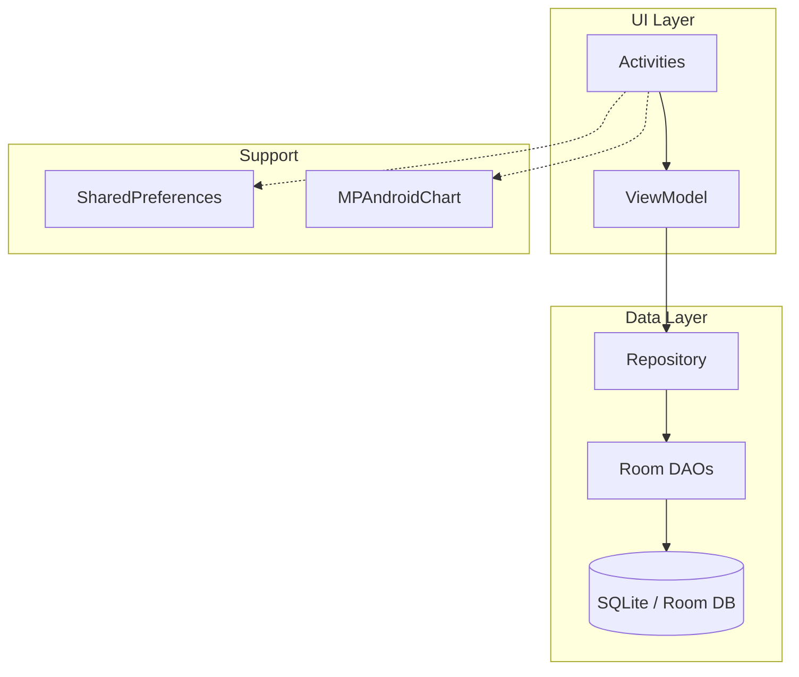

# Pebble Expense Tracker — Implementation Plan

## Overview

Build a fully functional Expense Tracker Android app using **Java + XML + Room + MVVM**. The app tracks income/expenses across multiple wallets, supports category management, and shows pie-chart breakdowns. The existing project is a clean Android Studio scaffold (`com.app.pebble`) with Material3 theme and a single empty `MainActivity`.

> [!IMPORTANT]
> This is **Phase 1 (Core Functionality)** only. All UI is kept deliberately minimal — standard Material Components, basic padding, readable text. Aesthetic redesign happens later.

---

## Architecture Diagram



**Data flow:** Activities observe `LiveData` from `ExpenseViewModel` → `ExpenseRepository` → Room DAOs → SQLite. Write operations use a single-thread `Executor`. SharedPreferences stores lightweight flags only (`is_first_run`, `user_name`).

---

## Complete File Manifest (~50 files)

```
app/src/main/java/com/app/pebble/
├── App.java                                          [NEW]
├── data/
│   ├── model/
│   │   ├── Wallet.java                               [NEW]
│   │   ├── Category.java                             [NEW]
│   │   └── Transaction.java                          [NEW]
│   ├── dao/
│   │   ├── WalletDao.java                            [NEW]
│   │   ├── CategoryDao.java                          [NEW]
│   │   └── TransactionDao.java                       [NEW]
│   └── db/
│       └── AppDatabase.java                          [NEW]
├── repository/
│   └── ExpenseRepository.java                        [NEW]
├── viewmodel/
│   └── ExpenseViewModel.java                         [NEW]
├── ui/
│   ├── onboarding/
│   │   ├── NameInputActivity.java                    [NEW]
│   │   └── WalletSetupActivity.java                  [NEW]
│   ├── home/
│   │   ├── HomeActivity.java                         [NEW]
│   │   └── RecentTransactionAdapter.java             [NEW]
│   ├── income/
│   │   └── IncomeDetailActivity.java                 [NEW]
│   ├── transaction/
│   │   ├── AddTransactionActivity.java               [NEW]
│   │   └── TransferActivity.java                     [NEW]
│   ├── wallets/
│   │   ├── WalletsActivity.java                      [NEW]
│   │   └── WalletAdapter.java                        [NEW]
│   └── settings/
│       ├── SettingsActivity.java                     [NEW]
│       └── CategoryManagerActivity.java              [NEW]
├── utils/
│   ├── DateUtils.java                                [NEW]
│   ├── NumberUtils.java                              [NEW]
│   └── Constants.java                                [NEW]
│
├── MainActivity.java                                 [MODIFY → becomes router]

app/src/main/res/
├── layout/
│   ├── activity_main.xml                             [MODIFY → minimal splash/router]
│   ├── activity_name_input.xml                       [NEW]
│   ├── activity_wallet_setup.xml                     [NEW]
│   ├── activity_home.xml                             [NEW]
│   ├── activity_add_transaction.xml                  [NEW]
│   ├── activity_transfer.xml                         [NEW]
│   ├── activity_income_detail.xml                    [NEW]
│   ├── activity_wallets.xml                          [NEW]
│   ├── activity_settings.xml                         [NEW]
│   ├── activity_category_manager.xml                 [NEW]
│   ├── item_transaction.xml                          [NEW]
│   ├── item_wallet.xml                               [NEW]
│   ├── item_wallet_setup.xml                         [NEW]
│   ├── item_category.xml                             [NEW]
│   └── dialog_add_category.xml                       [NEW]
├── menu/
│   └── bottom_nav_menu.xml                           [NEW]
├── values/
│   ├── strings.xml                                   [MODIFY]
│   ├── colors.xml                                    [MODIFY]
│   └── dimens.xml                                    [NEW]
├── drawable/
│   └── (placeholder icons for categories)            [NEW]

Other:
├── build.gradle.kts (app)                            [MODIFY]
├── gradle/libs.versions.toml                         [MODIFY]
├── settings.gradle.kts                               [MODIFY — add jitpack]
├── AndroidManifest.xml                               [MODIFY]
```

---

## Phase 1: Setup & Database

**Goal:** Add all Gradle dependencies, create Room entities, DAOs, and Database singleton.

### [MODIFY] [libs.versions.toml](file:///f:/pebble/gradle/libs.versions.toml)
Add version entries for:
- `room = "2.6.1"` — Room runtime, compiler
- `lifecycle = "2.8.7"` — ViewModel, LiveData
- `mpandroidchart = "v3.1.0"` — Pie/Donut charts

Add library entries:
```toml
room-runtime = { group = "androidx.room", name = "room-runtime", version.ref = "room" }
room-compiler = { group = "androidx.room", name = "room-compiler", version.ref = "room" }
lifecycle-viewmodel = { group = "androidx.lifecycle", name = "lifecycle-viewmodel", version.ref = "lifecycle" }
lifecycle-livedata = { group = "androidx.lifecycle", name = "lifecycle-livedata", version.ref = "lifecycle" }
mpandroidchart = { group = "com.github.PhilJay", name = "MPAndroidChart", version.ref = "mpandroidchart" }
```

### [MODIFY] [settings.gradle.kts](file:///f:/pebble/settings.gradle.kts)
Add `maven("https://jitpack.io")` to `dependencyResolutionManagement.repositories` for MPAndroidChart.

### [MODIFY] [build.gradle.kts](file:///f:/pebble/app/build.gradle.kts)
- Add `annotationProcessor(libs.room.compiler)` for Room annotation processing
- Add all new library dependencies
- Room schema export config: `javaCompileOptions { annotationProcessorOptions { arguments += mapOf("room.schemaLocation" to "$projectDir/schemas") } }`

### [NEW] Wallet.java — `data/model/`
Room `@Entity` with fields:
| Field | Type | Notes |
|-------|------|-------|
| `id` | `int` | `@PrimaryKey(autoGenerate = true)` |
| `name` | `String` | Wallet name (e.g., "Cash", "Bank") |
| `balance` | `double` | Current balance |
| `createdAt` | `long` | Unix timestamp |

### [NEW] Category.java — `data/model/`
Room `@Entity` with fields:
| Field | Type | Notes |
|-------|------|-------|
| `id` | `int` | `@PrimaryKey(autoGenerate = true)` |
| `name` | `String` | Category name |
| `type` | `String` | `"INCOME"` or `"EXPENSE"` |
| `iconResName` | `String` | Drawable resource name (nullable, for Phase 1 use built-in Material icons) |

### [NEW] Transaction.java — `data/model/`
Room `@Entity` with fields and foreign keys to `Wallet` and `Category`:
| Field | Type | Notes |
|-------|------|-------|
| `id` | `int` | `@PrimaryKey(autoGenerate = true)` |
| `amount` | `double` | Always positive |
| `type` | `String` | `"INCOME"` or `"EXPENSE"` or `"TRANSFER"` |
| `categoryId` | `int` | FK → Category (0 for transfers) |
| `walletId` | `int` | FK → Wallet |
| `targetWalletId` | `int` | FK → Wallet (for transfers only, else 0) |
| `note` | `String` | Optional description |
| `date` | `long` | Unix timestamp |

### [NEW] WalletDao.java — `data/dao/`
- `@Insert` — insert wallet
- `@Update` — update wallet (balance changes)
- `@Delete` — delete wallet
- `@Query("SELECT * FROM Wallet ORDER BY createdAt DESC")` → `LiveData<List<Wallet>>`
- `@Query("SELECT * FROM Wallet WHERE id = :id")` → `LiveData<Wallet>`
- `@Query("SELECT * FROM Wallet")` → `List<Wallet>` (sync, for spinners)

### [NEW] CategoryDao.java — `data/dao/`
- `@Insert` — insert category
- `@Delete` — delete category
- `@Query` by type (`INCOME`/`EXPENSE`) → `LiveData<List<Category>>`
- `@Query` all → `LiveData<List<Category>>`
- `@Query` count transactions using a category (for safe-delete check)

### [NEW] TransactionDao.java — `data/dao/`
- `@Insert` — insert transaction
- `@Delete` — delete transaction
- `@Query` recent 10 → `LiveData<List<Transaction>>`
- `@Query` sum of INCOME for current month → `LiveData<Double>`
- `@Query` sum of EXPENSE for current month → `LiveData<Double>`
- `@Query` income grouped by categoryId for current month → `LiveData<List<CategoryTotal>>` (POJO with `categoryId`, `total`)
- `@Query` expense grouped by categoryId for current month (for future use)

### [NEW] AppDatabase.java — `data/db/`
- `@Database(entities = {Wallet.class, Category.class, Transaction.class}, version = 1)`
- Abstract DAO getters
- Singleton pattern with `Room.databaseBuilder()`
- `RoomDatabase.Callback` to pre-populate default categories on first create:
  - Income: Salary, Freelance, Investment, Gift, Other
  - Expense: Food, Transport, Shopping, Bills, Entertainment, Health, Education, Other

---

## Phase 2: Repository & ViewModel

**Goal:** Single Repository wraps all DAOs, single ViewModel exposes LiveData to all Activities.

### [NEW] ExpenseRepository.java — `repository/`
- Constructor takes `Application`, initializes DB + DAOs + `ExecutorService`
- Exposes all LiveData queries as pass-through
- All write operations (`insert`, `update`, `delete`) run on `Executors.newSingleThreadExecutor()`
- Key methods:
  - `insertWallet(Wallet w)` / `updateWallet(Wallet w)`
  - `insertCategory(Category c)` / `deleteCategory(Category c)`
  - `insertTransaction(Transaction t)` — also **updates wallet balance** atomically
  - `transferBetweenWallets(int fromId, int toId, double amount, String note)` — debit source, credit target, save transaction with type `TRANSFER`
  - `getTransactionCountForCategory(int categoryId)` → `LiveData<Integer>`

### [NEW] ExpenseViewModel.java — `viewmodel/`
- Extends `AndroidViewModel` (needs `Application` for Room)
- Holds `ExpenseRepository` instance
- Exposes:
  - `LiveData<List<Wallet>> allWallets`
  - `LiveData<List<Category>> incomeCategories` / `expenseCategories` / `allCategories`
  - `LiveData<List<Transaction>> recentTransactions`
  - `LiveData<Double> currentMonthIncome` / `currentMonthExpense`
  - `LiveData<List<CategoryTotal>> incomeByCategoryThisMonth`
  - All insert/update/delete methods delegating to repository

---

## Phase 3: First-Run Onboarding Flow

**Goal:** Router logic in `MainActivity`, name input, wallet setup, SharedPreferences flags.

### [NEW] Constants.java — `utils/`
```java
public static final String PREFS_NAME = "pebble_prefs";
public static final String KEY_FIRST_RUN = "is_first_run";
public static final String KEY_USER_NAME = "user_name";
```

### [NEW] App.java — root package
- Extends `Application`
- Provides static access to `SharedPreferences` (convenience)
- Declared in `AndroidManifest.xml` as `android:name=".App"`

### [MODIFY] MainActivity.java
Transform into a **router**:
1. Check `SharedPreferences` for `is_first_run` (default `true`)
2. If `true` → start `NameInputActivity`, finish self
3. If `false` → start `HomeActivity`, finish self

### [NEW] NameInputActivity.java — `ui/onboarding/`
- Simple screen: greeting text, `TextInputEditText` for name, "Continue" button
- Validates name is not empty
- Saves name to `SharedPreferences`
- Navigates to `WalletSetupActivity`

### [NEW] activity_name_input.xml
- `ConstraintLayout` with centered card containing title, subtitle, input field, button

### [NEW] WalletSetupActivity.java — `ui/onboarding/`
- Title: "Set up your wallets"
- `RecyclerView` showing wallet entries (name + balance input fields)
- "Add Another Wallet" button adds a row
- "Continue" button:
  - Validates at least 1 wallet with name & balance > 0
  - Inserts all wallets into Room via ViewModel
  - Sets `is_first_run = false`
  - Navigates to `HomeActivity`, clears back stack

### [NEW] activity_wallet_setup.xml
- `ConstraintLayout` with RecyclerView + two buttons at bottom

### [NEW] item_wallet_setup.xml
- Horizontal row: wallet name input + balance input + delete button

---

## Phase 4: Home Screen Layout & Logic

**Goal:** Main hub with greeting, summary cards, transaction list, bottom navigation.

### [NEW] HomeActivity.java — `ui/home/`
- **Top bar:** "Hey, [UserName]" + Settings icon (→ `SettingsActivity`)
- **Summary cards:** Two `MaterialCardView`s side by side
  - INCOME card: shows `currentMonthIncome` via LiveData, click → `IncomeDetailActivity`
  - EXPENSE card: shows `currentMonthExpense` via LiveData
- **Recent transactions:** `RecyclerView` with `RecentTransactionAdapter`
  - Observes `recentTransactions` LiveData
  - Empty state: "No transactions yet" placeholder
- **Bottom Navigation:** Home | Wallets tabs + centered FAB
  - Home tab = current screen
  - Wallets tab → `WalletsActivity`
  - FAB (+) → shows `AlertDialog` with 3 choices: Add Income / Add Expense / Transfer

### [NEW] activity_home.xml
```
ConstraintLayout
├── TextView (greeting)
├── ImageButton (settings icon)
├── LinearLayout (horizontal)
│   ├── MaterialCardView (income summary)
│   └── MaterialCardView (expense summary)
├── TextView ("Recent Transactions")
├── RecyclerView (transactions list)
├── TextView (empty state, visibility=GONE)
├── CoordinatorLayout
│   ├── BottomNavigationView
│   └── FloatingActionButton (centered above nav)
```

### [NEW] RecentTransactionAdapter.java — `ui/home/`
- `RecyclerView.Adapter` displaying: type icon, category name, amount (green for income / red for expense), formatted date
- Uses `DateUtils` and `NumberUtils` for formatting

### [NEW] item_transaction.xml
- Horizontal `ConstraintLayout`: icon | category+note | amount+date

### [NEW] bottom_nav_menu.xml — `res/menu/`
```xml
<item android:id="@+id/nav_home" android:title="Home" android:icon="@drawable/ic_home" />
<item android:id="@+id/nav_wallets" android:title="Wallets" android:icon="@drawable/ic_wallet" />
```

### [NEW] DateUtils.java — `utils/`
- `formatDate(long timestamp)` → "Apr 16, 2026"
- `formatTime(long timestamp)` → "12:30 PM"
- `getStartOfCurrentMonth()` → epoch millis
- `getEndOfCurrentMonth()` → epoch millis

### [NEW] NumberUtils.java — `utils/`
- `formatCurrency(double amount)` → "₹1,234.56" (or locale-aware)
- `formatCurrencyShort(double amount)` → "₹1.2K"

---

## Phase 5: Add Transaction Flow

**Goal:** Full form for adding income/expense, plus wallet-to-wallet transfer.

### [NEW] AddTransactionActivity.java — `ui/transaction/`
- Receives intent extra `TRANSACTION_TYPE` (`"INCOME"` or `"EXPENSE"`)
- Form fields:
  - Amount (`TextInputEditText`, numeric)
  - Category (`Spinner` / `AutoCompleteTextView`, filtered by type)
  - Wallet (`Spinner`, from all wallets)
  - Note (optional `TextInputEditText`)
  - Date (defaults to today, tap to show `DatePickerDialog`)
- "Save" button:
  - Validates: amount > 0, category selected, wallet selected
  - Creates `Transaction` object
  - Calls `viewModel.insertTransaction(transaction)`
  - The repository internally updates the wallet balance:
    - INCOME → `wallet.balance += amount`
    - EXPENSE → `wallet.balance -= amount` (check for negative? allow it for Phase 1)
  - Finish activity

### [NEW] activity_add_transaction.xml
- `ScrollView` > `ConstraintLayout` with form fields + Save button

### [NEW] TransferActivity.java — `ui/transaction/`
- Form fields:
  - Amount
  - From Wallet (`Spinner`)
  - To Wallet (`Spinner`)
  - Note (optional)
- "Transfer" button:
  - Validates: amount > 0, from ≠ to, both wallets selected
  - Calls `viewModel.transfer(fromId, toId, amount, note)`
  - Repository handles: debit source, credit target, insert `TRANSFER` transaction

### [NEW] activity_transfer.xml
- Similar form layout with two wallet spinners

---

## Phase 6: Income Detail & Chart Integration

**Goal:** Category-wise breakdown + MPAndroidChart Pie/Donut chart.

### [NEW] IncomeDetailActivity.java — `ui/income/`
- Title bar: "Income Breakdown"
- `PieChart` (MPAndroidChart) showing income by category for current month
  - Donut mode enabled (`setDrawHoleEnabled(true)`)
  - Center text: total income
  - Color-coded slices per category
- Below chart: `RecyclerView` list of categories + amounts
- Observes `incomeByCategoryThisMonth` LiveData
- Maps `categoryId` → category name via ViewModel lookup
- Empty state if no income this month

### [NEW] activity_income_detail.xml
```
ConstraintLayout
├── Toolbar/TextView (title)
├── PieChart (MPAndroidChart)
├── RecyclerView (category breakdown list)
├── TextView (empty state)
```

> [!NOTE]
> The same pattern can be reused for an `ExpenseDetailActivity` later. For Phase 1, only income detail is hooked up since the spec explicitly requires it.

---

## Phase 7: Wallets & Category Management

**Goal:** Wallet list screen + Settings with category CRUD.

### [NEW] WalletsActivity.java — `ui/wallets/`
- `RecyclerView` with `WalletAdapter`
- Each item shows: wallet name, formatted balance
- Tap wallet → (Phase 1: no edit, just show a Toast or snackbar)
- Empty state if no wallets
- Observe `allWallets` LiveData

### [NEW] WalletAdapter.java — `ui/wallets/`
- Simple adapter: name + balance per row

### [NEW] item_wallet.xml
- `MaterialCardView` with name (start) and balance (end)

### [NEW] activity_wallets.xml
- `ConstraintLayout` with RecyclerView + empty state text

### [NEW] SettingsActivity.java — `ui/settings/`
- Simple list:
  - "Manage Categories" → opens `CategoryManagerActivity`
  - "User Name" → shows current name, tappable to edit (inline dialog)
  - App version text at bottom

### [NEW] activity_settings.xml
- `LinearLayout` with setting rows

### [NEW] CategoryManagerActivity.java — `ui/settings/`
- `TabLayout` with two tabs: INCOME | EXPENSE
- `RecyclerView` listing categories for selected tab
- Each item: icon (or placeholder) + name + delete button
  - Delete: checks `getTransactionCountForCategory(id)` first
  - If count > 0: show error "Cannot delete — X transactions use this category"
  - If count == 0: confirm dialog → delete
- FAB to add new category → shows `AlertDialog` with:
  - Name input
  - Type toggle (auto-set from current tab)
  - Icon: Phase 1 uses a simple drawable picker (hardcoded list of ~10 Material icons)
- Observe `incomeCategories` / `expenseCategories` LiveData

### [NEW] activity_category_manager.xml
- `ConstraintLayout` with TabLayout + RecyclerView + FAB

### [NEW] item_category.xml
- Row: icon + name + delete button

### [NEW] dialog_add_category.xml
- `LinearLayout`: name input + type indicator

---

## Phase 8: Polish & Edge Cases

**Goal:** Empty states, input validation, rotation handling, back-press safety.

### Changes across all Activities:
- **Empty states:** Every `RecyclerView` has an associated `TextView` with "No items yet" that toggles based on list size
- **Input validation:** All forms show `TextInputLayout` errors (red text) for invalid input
- **Rotation survival:** All state lives in `ViewModel` (LiveData), no data loss on rotation
- **Back press:** Proper `finish()` calls, no orphaned activities in back stack
- **Null safety:** All LiveData observers check for `null` data before updating UI
- **Number formatting:** All currency values use `NumberUtils.formatCurrency()`
- **Date formatting:** All dates use `DateUtils.formatDate()`

### Resource files:

#### [MODIFY] strings.xml
All user-facing strings extracted: greeting template, button labels, empty states, error messages, dialog titles, etc.

#### [MODIFY] colors.xml
Basic functional colors:
- `color_income` → green (#4CAF50)
- `color_expense` → red (#F44336)
- `color_transfer` → blue (#2196F3)
- Standard Material surface/background colors

#### [NEW] dimens.xml
Standard spacing values: `padding_small` (8dp), `padding_medium` (16dp), `padding_large` (24dp), `text_size_title` (20sp), etc.

---

## AndroidManifest Changes

### [MODIFY] [AndroidManifest.xml](file:///f:/pebble/app/src/main/AndroidManifest.xml)

```xml
<application android:name=".App" ...>
    <!-- MainActivity stays as LAUNCHER - acts as router -->
    <activity android:name=".MainActivity" android:exported="true">
        <intent-filter>
            <action android:name="android.intent.action.MAIN" />
            <category android:name="android.intent.category.LAUNCHER" />
        </intent-filter>
    </activity>
    
    <!-- Onboarding -->
    <activity android:name=".ui.onboarding.NameInputActivity" />
    <activity android:name=".ui.onboarding.WalletSetupActivity" />
    
    <!-- Core -->
    <activity android:name=".ui.home.HomeActivity" />
    <activity android:name=".ui.transaction.AddTransactionActivity" />
    <activity android:name=".ui.transaction.TransferActivity" />
    <activity android:name=".ui.income.IncomeDetailActivity" />
    <activity android:name=".ui.wallets.WalletsActivity" />
    
    <!-- Settings -->
    <activity android:name=".ui.settings.SettingsActivity" />
    <activity android:name=".ui.settings.CategoryManagerActivity" />
</application>
```

---

## Dependency Summary

| Library | Purpose | Version |
|---------|---------|---------|
| `androidx.room:room-runtime` | Room ORM | 2.6.1 |
| `androidx.room:room-compiler` | Room annotation processor | 2.6.1 |
| `androidx.lifecycle:lifecycle-viewmodel` | ViewModel | 2.8.7 |
| `androidx.lifecycle:lifecycle-livedata` | LiveData | 2.8.7 |
| `com.github.PhilJay:MPAndroidChart` | Pie/Donut charts | v3.1.0 |
| `com.google.android.material:material` | Material Components | 1.13.0 (existing) |
| `androidx.constraintlayout:constraintlayout` | Layouts | 2.2.1 (existing) |

---

## Key Design Decisions

> [!IMPORTANT]
> **Single ViewModel approach:** One `ExpenseViewModel` shared across all Activities. This keeps things simple for Phase 1. Each Activity creates its own instance via `ViewModelProvider`, but since they all use the same underlying `ExpenseRepository` (singleton DB), data stays consistent. If the app grows, we can split into per-feature ViewModels later.

> [!NOTE]
> **No Fragments in Phase 1:** All screens are full Activities. The BottomNavigationView navigates between Activities (with `finish()` on the current one to avoid deep back stacks). This is explicitly simpler than Fragment-based navigation for Phase 1.

> [!NOTE]
> **Transfer transactions:** Stored as a single `Transaction` with `type = "TRANSFER"`, referencing both `walletId` (source) and `targetWalletId` (destination). The repository atomically updates both wallet balances.

> [!NOTE]
> **Category icons:** Phase 1 uses a simple hardcoded list of Material icon drawable resource names. No `Intent.ACTION_GET_CONTENT` picker yet — that's a Phase 2 enhancement.

---

## Verification Plan

### Build Verification
- Run `./gradlew assembleDebug` to confirm clean compilation
- Verify Room schema generates without errors

### Functional Verification (Manual)
1. **First run:** App shows NameInputActivity → WalletSetupActivity → HomeActivity
2. **Second run:** App skips onboarding, goes directly to HomeActivity
3. **Add income:** FAB → Add Income → fill form → save → income total updates, transaction appears in list
4. **Add expense:** Same flow, expense total updates
5. **Transfer:** FAB → Transfer → fill form → save → both wallet balances update
6. **Income detail:** Tap income card → pie chart shows category breakdown
7. **Wallets screen:** Bottom nav → Wallets tab → all wallets listed with correct balances
8. **Categories:** Settings → Manage Categories → add/delete categories
9. **Rotation:** Rotate device on any screen → no data loss, no crashes
10. **Empty states:** Fresh app after onboarding → "No transactions yet" shown

### Edge Case Verification
- Empty name input → shows error, blocks save
- Zero/negative amount → shows error, blocks save
- Delete category with transactions → blocked with error message
- Transfer to same wallet → blocked with error message
- Back press from onboarding → proper handling (can't skip setup)

---

## Execution Order

I will implement files in this exact order to ensure each phase compiles before moving on:

1. **Gradle + Manifest** — dependencies, manifest updates
2. **Models** — `Wallet.java`, `Category.java`, `Transaction.java`
3. **DAOs** — `WalletDao.java`, `CategoryDao.java`, `TransactionDao.java`
4. **Database** — `AppDatabase.java`
5. **Utils** — `Constants.java`, `DateUtils.java`, `NumberUtils.java`
6. **Repository** — `ExpenseRepository.java`
7. **ViewModel** — `ExpenseViewModel.java`
8. **App.java** — Application class
9. **Resources** — `strings.xml`, `colors.xml`, `dimens.xml`, `bottom_nav_menu.xml`
10. **Onboarding** — layouts + Activities (NameInput, WalletSetup)
11. **Home** — layout + Activity + adapter
12. **Add Transaction** — layout + Activity
13. **Transfer** — layout + Activity
14. **Income Detail** — layout + Activity + chart config
15. **Wallets** — layout + Activity + adapter
16. **Settings + Categories** — layouts + Activities
17. **Router** — update `MainActivity` to route
18. **Polish** — empty states, validation, edge cases

> [!NOTE]
> **📌 Phase 1 ends after step 18.** Core functionality will be fully operational with basic UI, ready for aesthetic redesign.
